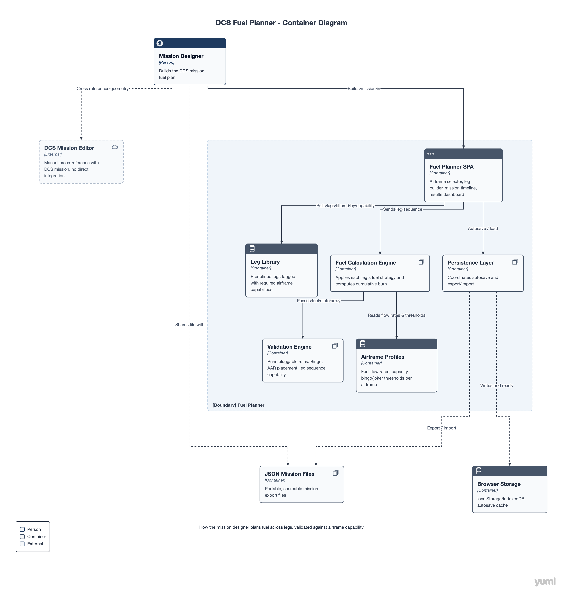

# Bingo Board

A mission fuel planner for DCS World. Build a mission as an airframe plus an ordered sequence of legs — departure, navigation, tanking, tactical, recovery — and get cumulative fuel burn, reserve checks, and validation warnings before you ever load into the sim.

> Named for "bingo fuel" — the minimum fuel state at which you must break off and return to base.

## Why

Mission design (and mission *briefing*) needs a real fuel plan: how much gas to load, whether an AAR is required, and whether the mission is even flyable on internal fuel alone. This tool builds that plan leg-by-leg instead of guessing a round number and hoping.

<!-- ## Documentation
- [Architecture (C4)](docs/architecture/c4-context.md)
- [Entity Diagram](docs/data/entity-diagram.md)
- [Dev Environment Setup (SSH)](docs/setup/ssh-setup.md)## Architecture -->



The app is a client-side SPA with no backend. Mission plans autosave to browser storage and can be exported/imported as portable JSON files for sharing.

**Core containers**

- **Fuel Planner SPA** — airframe selector, leg builder, mission timeline, results dashboard
- **Fuel Calculation Engine** — applies each leg's fuel strategy (fixed or computed) and produces a cumulative fuel state array
- **Validation Engine** — runs pluggable rules (bingo threshold, AAR placement, leg sequencing, airframe capability) against the fuel state array
- **Leg Library** — reusable, airframe-agnostic leg definitions (Case I/III departure & recovery, AAR, waypoint nav, holding), each tagged with required airframe capabilities
- **Airframe Profiles** — fuel flow rates by phase, capacity, and bingo/joker thresholds per airframe
- **Persistence Layer** — coordinates autosave to browser storage and JSON export/import

## Domain model

```
Airframe
├── FuelCapacity
├── FuelFlowRates (by phase: taxi, climb, cruise, combat, loiter)
├── BingoThreshold / JokerThreshold
└── Capabilities[] (e.g. CarrierOperations, ProbeRefuel, BoomRefuel)

Leg (base)
├── FuelStrategy: Fixed | Computed
└── RequiredCapabilities[]

Leg subtypes: WaypointNavLeg, AARLeg, CaseIDeparture, CaseIIIDeparture,
              CaseIRecovery, CaseIIIRecovery, HoldingLeg, LoiterLeg

Mission
├── Airframe
└── Leg[] (ordered)
```

Legs are **airframe-agnostic but capability-gated** — an F/A-18C can fly a Case I recovery; a non-carrier-capable airframe simply won't see that leg type in its picker.

## Validation

Mission validation runs in two passes:

1. **Fuel state pass** — walk the ordered legs, compute cumulative fuel remaining after each one
2. **Rules pass** — pluggable rules check that state array for problems (fuel below bingo before a recovery leg, missing AAR leg on a fuel-short mission, invalid leg ordering, capability mismatches)

## Status

Early architecture / design phase — domain model and C4 diagrams above, implementation in progress.

## Documentation

- [Airframe Profile Design](./docs/design/airframe-profile-design.md)
- [Leg Design](./docs/design/leg-design.md)
- [Fuel calculation engine](./docs/design/fuel-calculation-engine-design.md)

## Roadmap

- [ ] Core domain model (Airframe, Leg, Mission)
- [ ] Fuel calculation engine
- [ ] Validation rule engine
- [ ] Leg library with capability tagging
- [ ] Browser autosave + JSON export/import
- [ ] UI: airframe selector, leg builder, mission timeline
- [ ] Additional airframe profiles

## License

TBD
